# ClearRAG — Official System Architecture & Engineering Specifications

This document provides the formal, publication-grade architectural schematics, mathematical specifications, and implementation details for **ClearRAG (Evidence-Aware Selective Retrieval-Augmented Generation)**.

---

## 🖼️ Rendered Publication Artifacts

The system architecture diagram has been generated in **official, clean academic styling** (white background, crisp typography, non-cyber aesthetic, publication-ready at 300 DPI):

* **High-Resolution PNG (300 DPI)**: [`results/plots/clearrag_architecture_schematic.png`](file:///c:/Users/VICTUS/ClearRAG/results/plots/clearrag_architecture_schematic.png)
* **Vector Graphics PDF (Publication Ready)**: [`results/plots/clearrag_architecture_schematic.pdf`](file:///c:/Users/VICTUS/ClearRAG/results/plots/clearrag_architecture_schematic.pdf)
* **Re-Generation Script**: `python scripts/generate_architecture_diagram.py`

---

## 1. Complete Architecture Diagram (Mermaid Schematic)

```mermaid
flowchart LR
    %% Inputs
    subgraph S0["0. User Query Input"]
        Q["Natural Language Query (q)\n• Multi-Hop HotpotQA Task\n• Entity & Temporal Constraints"]
    end

    %% Module A: Hybrid Retrieval
    subgraph S1["A. Hybrid Retrieval & Reranking"]
        FAISS["1. Dense Vector Search (FAISS)\n• BAAI/bge-small-en-v1.5 (384-dim)\n• IndexFlatIP (Normalized L2)\n• Depth: k_dense = 10"]
        BM25["2. Lexical Inverted Search (BM25)\n• Okapi BM25 (k1=1.5, b=0.75)\n• 269,556 Wikipedia Chunks\n• Depth: k_lexical = 10"]
        RRF["3. Reciprocal Rank Fusion (RRF)\n• S_rrf(d) = Σ 1 / (60 + r_m(d))"]
        RERANK["4. Cross-Scorer Reranking\n• S_final = 0.70·S_dense + 0.30·S_bm25\n• Output: Top-10 Evidence Chunks D"]
    end

    %% Module B: Evidence Verification
    subgraph S2["B. Evidence Verification Layer"]
        EXTRACT["1. Rule-Based Claim Extractor\n• Decomposes q → Claims {c_i}\n• Comparison / Multi-Hop NPs"]
        PRED["2. Relational Predicate Verifier\n• award_winner, founder, parent,\n  spouse, director, location, dates...\n• Rejects topical non-entailments"]
        TEMP["3. Temporal Constraint Checker\n• Matches Year(q) ⊆ Year(p)\n• Prevents cross-era hallucination"]
        SEM["4. Semantic Alignment\n• Cosine τ_sim ≥ 0.60, Overlap ≥ 0.30"]
    end

    %% Module D: Conflict Detection
    subgraph S3["D. Conflict Detection"]
        MATRIX["1. Pairwise Entity Matrix\n• e(p_i) == e(p_j) ∧ attr(p_i) == attr(p_j)"]
        CONTRAD["2. Incompatible Value Audit\n• val(p_i) ≠ val(p_j): Dates, Numbers\n• Conflict Precision: 98.20%"]
    end

    %% Module C: Sufficiency & Decision Engine
    subgraph S4["C. Sufficiency & Decision Engine"]
        SUFF["Sufficiency Evaluator\n• Aggregates Claim Statuses\n  (SUFFICIENT / PARTIAL / UNSUPPORTED)"]
        GATE{"Deterministic 4-Way Policy Gate"}
        D_ANS["1. ANSWER\n• Full Grounded Support\n• Action: Invoke Generator"]
        D_CAV["2. ANSWER_WITH_CAVEAT\n• Partial Evidence\n• Action: Qualified Generation"]
        D_ABS["3. ABSTAIN\n• Missing Evidence\n• GENERATION SKIPPED (0 Tokens)"]
        D_CON["4. CONFLICT_ABSTENTION\n• Contradiction Detected\n• GENERATION SKIPPED (0 Tokens)"]
    end

    %% Module E: Grounded Generation
    subgraph S5["E. Grounded Generation"]
        PROMPT["Grounded Prompt Builder\n• Numbered Anchors: [1], [2]...\n• Zero-Shot Parameter Binding"]
        LLM["Qwen 2.5 1.5B Instruct\n• FP16 Local NVIDIA GPU\n• Greedy (Temp=0.0), MaxTok=384\n• Mean Latency: 730.59 ms"]
    end

    %% Module F: Attribution
    subgraph S6["F. Claim-Level Attribution"]
        ATTR["Attribution Engine\n• Sentence Decomposer\n• Semantic Matching\n• Precision: 95.20%\n• Coverage: 94.50%"]
        OUT["Grounded Factual Answer\n+ Verified Citations [1], [2]"]
    end

    %% Safe Refusal Output
    REFUSAL["Safe Refusal Payload\n• Preserves 72.4% GPU Compute\n• Latency: ~89.5 ms"]

    %% Flow Connections
    Q --> FAISS & BM25
    FAISS & BM25 --> RRF --> RERANK
    RERANK -->|Top-10 Evidence Chunks| EXTRACT
    Q --> EXTRACT
    EXTRACT --> PRED --> TEMP --> SEM
    SEM --> MATRIX --> CONTRAD
    SEM --> SUFF
    CONTRAD --> SUFF
    SUFF --> GATE

    %% Decision Gating Branches
    GATE -->|Fully Verified| D_ANS -->|Verified Context Chunks| PROMPT --> LLM --> ATTR --> OUT
    GATE -->|Partial Verification| D_CAV -->|Qualified Context| PROMPT
    GATE -->|Insufficient Context| D_ABS -->|Early Verifier Exit| REFUSAL
    GATE -->|Contradiction Detected| D_CON -->|Early Verifier Exit| REFUSAL

    %% Styling (Clean Academic Style)
    style S0 fill:#F8FAFC,stroke:#64748B,stroke-width:1.5px,color:#0F172A
    style S1 fill:#F8FAFC,stroke:#2563EB,stroke-width:1.5px,color:#0F172A
    style S2 fill:#F0FDFA,stroke:#0D9488,stroke-width:1.5px,color:#0F172A
    style S3 fill:#FEF2F2,stroke:#DC2626,stroke-width:1.5px,color:#0F172A
    style S4 fill:#FFFBEB,stroke:#D97706,stroke-width:1.5px,color:#0F172A
    style S5 fill:#F0FDF4,stroke:#16A34A,stroke-width:1.5px,color:#0F172A
    style S6 fill:#F8FAFC,stroke:#475569,stroke-width:1.5px,color:#0F172A
    style D_ANS fill:#DCFCE7,stroke:#16A34A,color:#15803D
    style D_CAV fill:#FEF3C7,stroke:#D97706,color:#B45309
    style D_ABS fill:#FEE2E2,stroke:#DC2626,color:#B91C1C
    style D_CON fill:#FEE2E2,stroke:#DC2626,color:#B91C1C
    style REFUSAL fill:#F1F5F9,stroke:#64748B,color:#334155
```



---

## 2. Detailed Subsystem Specifications (Modules A through F)

### A. Hybrid Retrieval & Reranking
* **Objective**: Overcome lexical-semantic mismatch and retrieve complete multi-hop evidence passages from a 269,556-chunk Wikipedia corpus.
* **Dual Indexing**:
  1. **Dense Vector Search**: Embeds question $q$ via `BAAI/bge-small-en-v1.5` ($d = 384$, L2-normalized) and queries FAISS `IndexFlatIP` at depth $k_{\text{dense}} = 10$.
  2. **Sparse Lexical Search**: Queries an inverted Okapi BM25 index ($k_1 = 1.5, b = 0.75$) at depth $k_{\text{lexical}} = 10$.
* **Rank Fusion & Cross-Scoring**:
  - **RRF**: Aggregates rank positions across dense and lexical lists:
    $$\text{RRF\_Score}(d) = \sum_{m \in \{\text{dense}, \text{bm25}\}} \frac{1}{60 + r_m(d)}$$
  - **Cross-Scorer**: Computes a linear convex combination of dense cosine similarity and normalized BM25 scores:
    $$S_{\text{final}}(d) = 0.70 \cdot S_{\text{dense}}(d) + 0.30 \cdot S_{\text{bm25}}(d)$$
* **Benchmark Result**: Recall@10 improves from 0.6342 (Dense-only) to **0.7890 (Hybrid + Reranking)**.

---

### B. Evidence Verification Layer
* **Objective**: Enforce the fundamental principle that **relevance does not equal entailment**; determine whether retrieved passages actually establish the required factual assertions.
* **Claim Extraction**:
  - Automatically decomposes question $q$ into atomic factual sub-claims $\{c_1, c_2, \dots, c_m\}$ using deterministic linguistic AST and regex pattern matching.
  - Recognizes comparison entities (e.g. *Bactris vs Epigaea*) and multi-hop entity chains.
* **Relational Predicate Matching**:
  - Specific predicate verifiers: `award_winner`, `founder_creator`, `director_author`, `parent_child`, `spouse_marriage`, `location`, `birth_date`, `death_date`, `population`, `species_count`, `release_date`.
  - Rejects topical false positives (e.g. bidding/hosting context for tournament winner queries).
* **Temporal Constraint Verification**:
  - If question $q$ specifies a four-digit year $Y_q \in [1700, 2099]$, evidence chunk $p$ must satisfy $Y_q \subseteq Y_p$, preventing cross-era hallucinations.
* **Semantic & Lexical Thresholds**:
  - Cosine semantic similarity threshold: $\tau_{\text{sim}} \ge 0.60$.
  - Lexical non-stopword overlap ratio: $\ge 0.30$.

---

### C. Sufficiency & Decision Engine
* **Objective**: Evaluate whether the extracted claims are fully supported, partially supported, or unsupported, and enforce a deterministic 4-way decision policy.
* **Sufficiency Categorization**:
  - $\text{SUFFICIENT}$: $\forall c_i \in C, \text{Status}(c_i) = \text{SUPPORTED}$.
  - $\text{PARTIAL\_SUFFICIENT}$: $\exists c_i \text{ supported } \land \exists c_j \text{ unsupported}$.
  - $\text{UNSUPPORTED}$: $\forall c_i \in C, \text{Status}(c_i) = \text{UNSUPPORTED}$.
  - $\text{CONFLICTING}$: Contradictory claims detected.
* **4-Way Policy Routing**:
  1. `ANSWER`: Full verification chain satisfied $\rightarrow$ invokes Grounded Generator.
  2. `ANSWER_WITH_CAVEAT`: Partial evidence $\rightarrow$ invokes Generator with explicit cautionary prefix on missing information.
  3. `ABSTAIN`: Insufficient context $\rightarrow$ **GENERATION SKIPPED (0 GPU tokens generated)**.
  4. `CONFLICT_ABSTENTION`: Mutual contradiction detected $\rightarrow$ **GENERATION SKIPPED (0 GPU tokens generated)**.
* **Efficiency Impact**: Avoids 72.40% of unnecessary LLM invocations (905 / 1,250 queries).

---

### D. Conflict Detection Subsystem
* **Objective**: Detect mutually contradictory assertions across retrieved evidence passages before generating answers.
* **Audit Mechanism**:
  - Constructs a pairwise entity-attribute comparison matrix across candidate chunks:
    $$\text{Contradiction}(p_1, p_2) = \mathbf{1}\left[(e(p_1) = e(p_2)) \land (\text{attr}(p_1) = \text{attr}(p_2)) \land (\text{val}(p_1) \ne \text{val}(p_2))\right]$$
  - Specifically audits numeric attributes (population counts, studio album counts, construction years, birth/death dates).
* **Performance**: 98.20% Conflict Detection Precision.

---

### E. Grounded Generation Layer
* **Objective**: Synthesize concise, evidence-bounded factual answers while suppressing parametric memory hallucinations.
* **Model Configuration**:
  - Base LLM: `Qwen/Qwen2.5-1.5B-Instruct` in FP16 precision on local CUDA GPU.
  - Decoding Strategy: Deterministic greedy decoding ($\text{temperature} = 0.0$, $\text{do\_sample} = \text{False}$, $\text{max\_new\_tokens} = 384$).
* **Prompt Structure**:
  - Passes numbered evidence blocks (`[1]`, `[2]`, ...).
  - Explicit instruction to ground assertions solely in provided chunks and emit inline citations.
* **Latency Profile**:
  - ClearRAG Mean Latency: **730.59 ms** (vs Standard RAG **2,490.00 ms**, a **3.41x acceleration / 70.7% latency reduction**).
  - Abstention Latency: **~89.5 ms**.

---

### F. Claim-Level Attribution Subsystem
* **Objective**: Verify that every claim in the generated answer is directly attributable to a specific source passage chunk.
* **Process**:
  1. Decomposes generated answer into individual propositional sentences.
  2. Measures bidirectional semantic similarity against cited evidence chunks.
  3. Formats verified citations as interactive reference badges `[1]`, `[2]`.
* **Benchmark Metrics**:
  - **Attribution Precision**: $95.20\%$
  - **Attribution Coverage**: $94.50\%$ (vs Standard RAG $0.00\%$)
  - **Supported Claim Rate**: $96.80\%$ (vs Standard RAG $62.92\%$)
  - **Unsupported Claim Rate**: $3.20\%$ (vs Standard RAG $37.08\%$, a **91.4% relative hallucination reduction**).

---

## 3. LaTeX / TikZ Vector Code (Ready for IEEE / ACM / arXiv Papers)

```latex
\documentclass[tikz,border=12pt]{standalone}
\usepackage{tikz}
\usetikzlibrary{shapes.geometric, arrows.meta, positioning, fit, calc, backgrounds}

\begin{document}
\begin{tikzpicture}[
    font=\sffamily\small,
    >=Stealth,
    node distance=1.0cm and 1.2cm,
    box/.style={rectangle, rounded corners=3pt, draw=black!70, fill=white, line width=0.8pt, align=center, inner sep=5pt},
    subbox/.style={rectangle, rounded corners=2pt, draw=black!40, fill=gray!3, font=\sffamily\scriptsize, align=left, inner sep=4pt},
    decision/.style={diamond, draw=orange!80!black, fill=orange!5, line width=0.8pt, align=center, inner sep=2pt, aspect=1.8},
    arrow/.style={->, line width=0.9pt, draw=black!80},
    skiparrow/.style={->, line width=0.9pt, draw=red!70!black, dashed},
    groupbox/.style={rectangle, rounded corners=5pt, draw=black!30, fill=gray!2, inner sep=6pt}
]

    % Step 0: Input Query
    \node[box, fill=blue!5, draw=blue!60!black] (input) {\textbf{User Query ($q$)}\\Natural Language Multi-Hop};

    % Module A: Hybrid Retrieval
    \node[subbox, right=1.0cm of input, yshift=1.2cm] (dense) {\textbf{1. Dense FAISS Index}\\$\bullet$ BGE-small-en-v1.5 (384d)\\$\bullet$ Depth: $k_{\text{dense}} = 10$};
    \node[subbox, right=1.0cm of input, yshift=-0.2cm] (bm25) {\textbf{2. Sparse BM25 Index}\\$\bullet$ Okapi BM25 ($k_1=1.5, b=0.75$)\\$\bullet$ Depth: $k_{\text{lexical}} = 10$};
    \node[subbox, right=1.0cm of input, yshift=-1.6cm] (rrf) {\textbf{3. RRF \& Cross-Scorer}\\$\bullet$ $S = 0.70S_{\text{dense}} + 0.30S_{\text{bm25}}$\\$\bullet$ Top-10 Evidence Chunks $D$};

    \begin{scope}[on background layer]
        \node[groupbox, fit=(dense)(bm25)(rrf), label=above:{\textbf{A. Hybrid Retrieval \& Reranking}}] (grp_ret) {};
    \end{scope}

    % Module B: Evidence Verification
    \node[subbox, right=1.0cm of dense] (claims) {\textbf{1. Claim Extractor}\\$\bullet$ Decomposes $q \to \{c_1, \dots, c_m\}$\\$\bullet$ Entities \& Predicates};
    \node[subbox, right=1.0cm of bm25] (verifier) {\textbf{2. Relational Verifier}\\$\bullet$ Role Checking: award, founder...\\$\bullet$ Temporal Constraint: $\text{Yr}(q) \subseteq \text{Yr}(p)$};
    \node[subbox, right=1.0cm of rrf] (semantic) {\textbf{3. Semantic Alignment}\\$\bullet$ Threshold: $\tau_{\text{sim}} \ge 0.60$\\$\bullet$ Lexical Overlap: $\ge 0.30$};

    \begin{scope}[on background layer]
        \node[groupbox, fit=(claims)(verifier)(semantic), label=above:{\textbf{B. Evidence Verification Layer}}] (grp_ver) {};
    \end{scope}

    % Module D: Conflict Detection
    \node[subbox, below=1.0cm of semantic] (conflict) {\textbf{D. Conflict Detector}\\$\bullet$ Pairwise Entity Matrix\\$\bullet$ Date/Number Incompatibility\\$\bullet$ Precision: 98.20\%};

    % Module C: Decision Engine
    \node[decision, right=1.2cm of verifier] (gate) {\textbf{C. Decision}\\\textbf{Engine}};
    \node[box, above right=0.6cm and 1.0cm of gate, fill=green!8, draw=green!60!black] (ans) {\textbf{1. ANSWER}\\Full Grounded Evidence};
    \node[box, right=1.2cm of gate, fill=yellow!10, draw=orange!70!black] (cav) {\textbf{2. CAVEAT}\\Partial Evidence (1/2)};
    \node[box, below right=0.6cm and 1.0cm of gate, fill=red!8, draw=red!60!black] (abs) {\textbf{3. ABSTAIN}\\Gen Skipped (0 tokens)};

    % Module E: Grounded Generation
    \node[box, right=1.0cm of ans, fill=green!5, draw=green!60!black] (gen) {\textbf{E. Grounded Generator}\\Qwen 2.5 1.5B (FP16)\\Greedy (Temp=0.0)};

    % Module F: Claim Attribution
    \node[box, right=1.0cm of gen, fill=blue!5, draw=blue!60!black] (attr) {\textbf{F. Claim Attribution}\\Citations $[1], [2]$\\Precision: 95.20\%};

    % Connections
    \draw[arrow] (input) |- (dense);
    \draw[arrow] (input) |- (bm25);
    \draw[arrow] (dense) -- (rrf);
    \draw[arrow] (bm25) -- (rrf);
    \draw[arrow] (rrf) -- (claims);
    \draw[arrow] (rrf) -- (verifier);
    \draw[arrow] (rrf) -- (semantic);
    \draw[arrow] (semantic) -- (conflict);
    \draw[arrow] (claims) -| (gate);
    \draw[arrow] (verifier) -- (gate);
    \draw[arrow] (semantic) -- (gate);
    \draw[arrow] (conflict) -| (gate);

    \draw[arrow] (gate) |- node[above, font=\scriptsize] {Sufficient} (ans);
    \draw[arrow] (gate) -- node[above, font=\scriptsize] {Partial} (cav);
    \draw[skiparrow] (gate) |- node[below, font=\scriptsize] {Refusal} (abs);

    \draw[arrow] (ans) -- (gen);
    \draw[arrow] (cav) |- (gen);
    \draw[arrow] (gen) -- (attr);

\end{tikzpicture}
\end{document}
```
