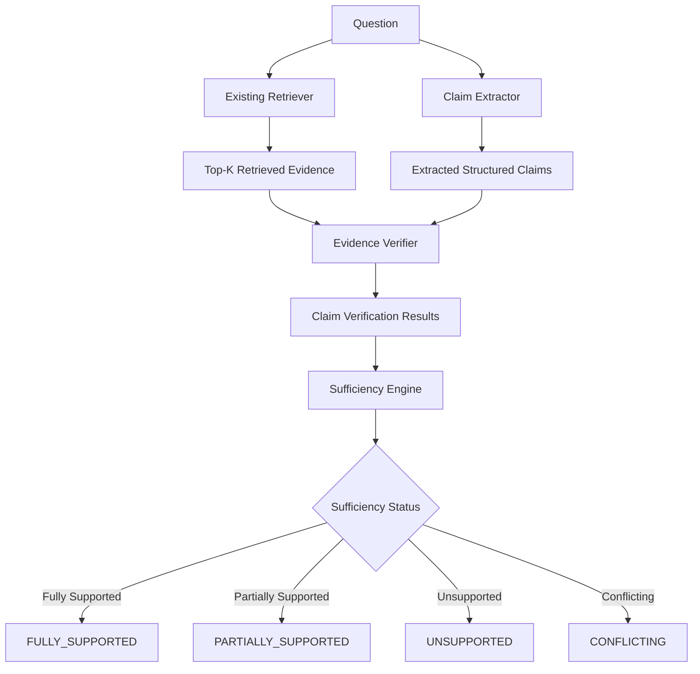

# Evidence Verification & Claim-Level Sufficiency Layer

## 1. Motivation

Standard RAG systems treat retrieval as a black box: if documents are returned by vector search, the LLM is prompted to answer immediately. However, **retrieval relevance is not equivalent to evidence support**. A retrieved passage may be topically relevant to a question or entity without containing the actual factual evidence required to justify an answer.

ClearRAG introduces an inspectable, deterministic **Evidence Verification Layer** between retrieval and generation. This layer decomposes questions into structured claims, evaluates each claim against retrieved evidence passages, detects synthetic numeric/date conflicts, and determines the overall evidence sufficiency (`FULLY_SUPPORTED`, `PARTIALLY_SUPPORTED`, `UNSUPPORTED`, `CONFLICTING`).

---

## 2. Architecture

---

## 3. Core Modules & Representations

### Claim Representation ([src/verification/claims.py](file:///c:/Users/VICTUS/ClearRAG/src/verification/claims.py))
Claims are structured dataclasses containing:
- `claim_id`: Unique identifier
- `text`: Plain text description of the claim requirement
- `claim_type`: Enum (`ATOMIC_FACT`, `COMPARISON_ENTITY_A`, `COMPARISON_ENTITY_B`, `MULTI_HOP`)
- `target_entities`: List of primary entities required for the claim
- `source_question`: Original source question

### Claim Extraction ([src/verification/claim_extractor.py](file:///c:/Users/VICTUS/ClearRAG/src/verification/claim_extractor.py))
Isolated behind `BaseClaimExtractor`. `RuleBasedClaimExtractor` implements deterministic pattern matching:
- **Comparison Questions**: (e.g. *"Which genus has more species, Bactris or Epigaea?"*) $\rightarrow$ Extracts distinct claims for `Bactris` and `Epigaea`.
- **Multi-Hop / Bridge Questions**: Extracts claims for all primary named entities.
- **Single Atomic Questions**: Extracts 1 atomic claim.

### Evidence Verification & Matching ([src/verification/evidence_verifier.py](file:///c:/Users/VICTUS/ClearRAG/src/verification/evidence_verifier.py))
Differentiates **Retrieval Relevance** (topical vector similarity) from **Evidence Support**:
- **Entity Matching**: Verifies target entities are present in the passage.
- **Lexical/Factual Overlap**: Computes keyword and token overlap ratio.
- **Conflict Detection**: Specifically scans for synthetic numeric and date perturbations across passages referencing the same entity (e.g. `1907` vs `1908`).

### Sufficiency Policy ([src/verification/sufficiency.py](file:///c:/Users/VICTUS/ClearRAG/src/verification/sufficiency.py))
Maps per-claim statuses to an overall decision:
- `CONFLICTING`: Triggered if any claim exhibits conflicting evidence or contradictory numeric values.
- `FULLY_SUPPORTED`: Triggered when all required claims are supported by retrieved evidence without conflict.
- `PARTIALLY_SUPPORTED`: Triggered when some claims are supported but at least one required claim lacks evidence.
- `UNSUPPORTED`: Triggered when no required claims have supporting evidence.

---

## 4. Evaluation Methodology

The verification layer is evaluated on the 1,250 instance benchmark ([clearrag_eval.json](file:///c:/Users/VICTUS/ClearRAG/data/evaluation/clearrag_eval.json)) using `scripts/evaluate_verification.py`:

> [!IMPORTANT]
> **Strict Evaluation Isolation**: The verification layer receives ONLY `(question, retrieved_evidence)`. Ground-truth benchmark condition metadata is strictly excluded from inference and used solely for post-hoc classification accuracy and confusion matrix calculation.

---

## 5. Limitations & Known Failure Cases

1. **Complex Semantic Paraphrasing**: Lexical/rule-based matching can miss complex indirect paraphrases that lack explicit token overlap.
2. **Implicit Numerical Ranges**: Complex relational math (e.g. "x > y" inferred from multi-sentence narrative logic) requires full LLM reasoning.
3. **Entity Coreference**: Pronoun resolution across multi-paragraph chunks can result in false negatives if entity names are not explicitly mentioned in every chunk.
